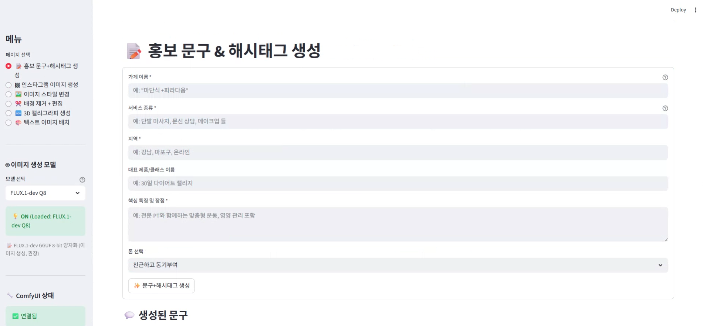
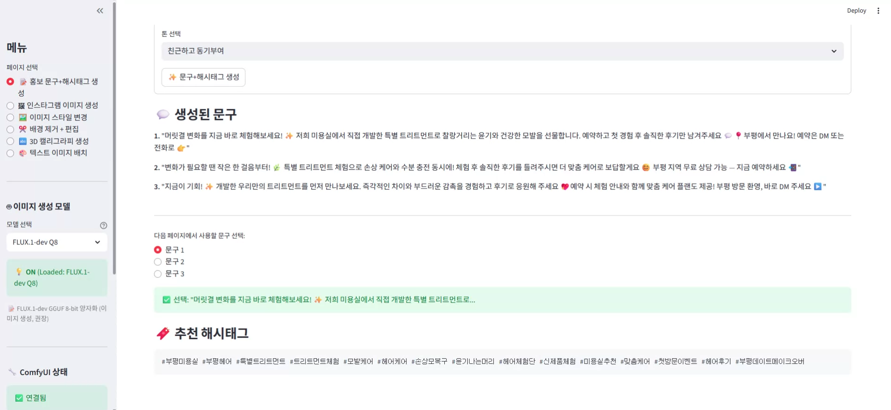
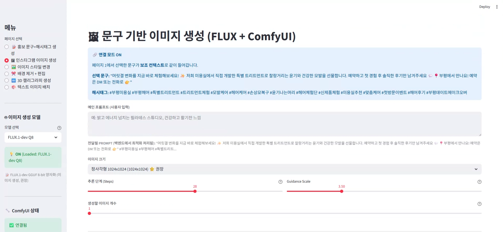
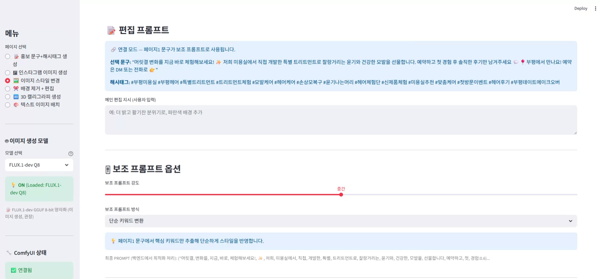
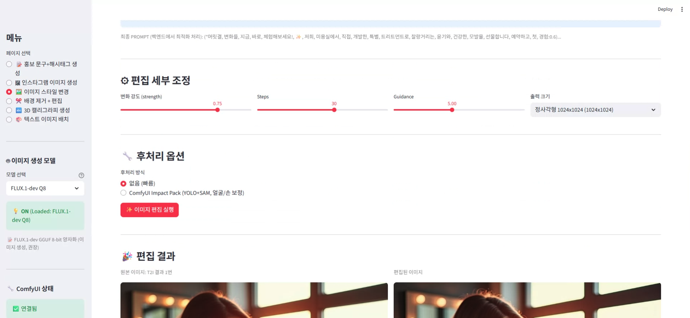
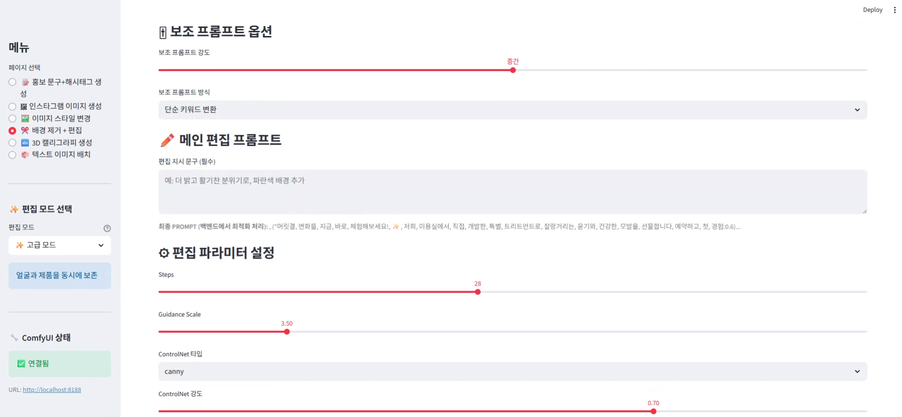
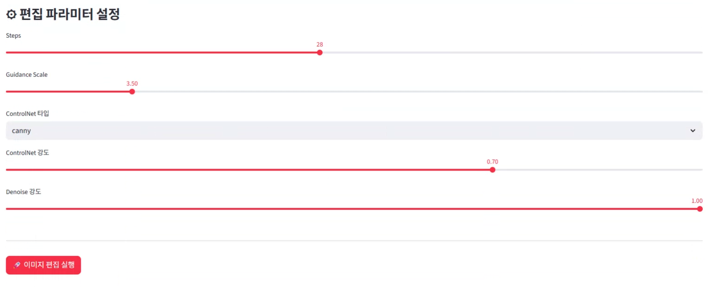
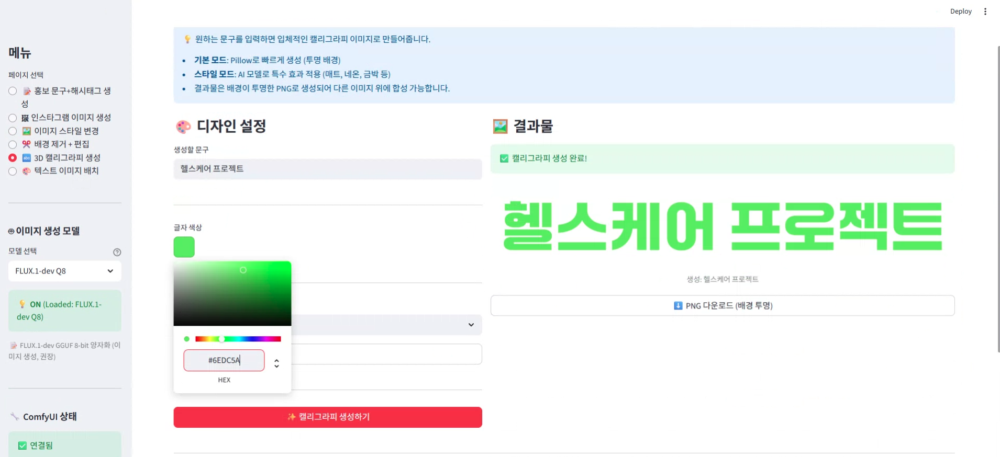
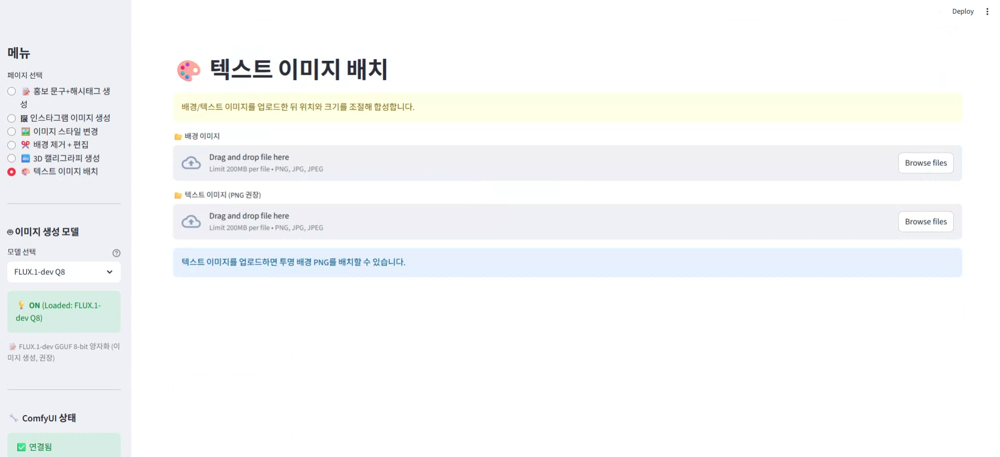
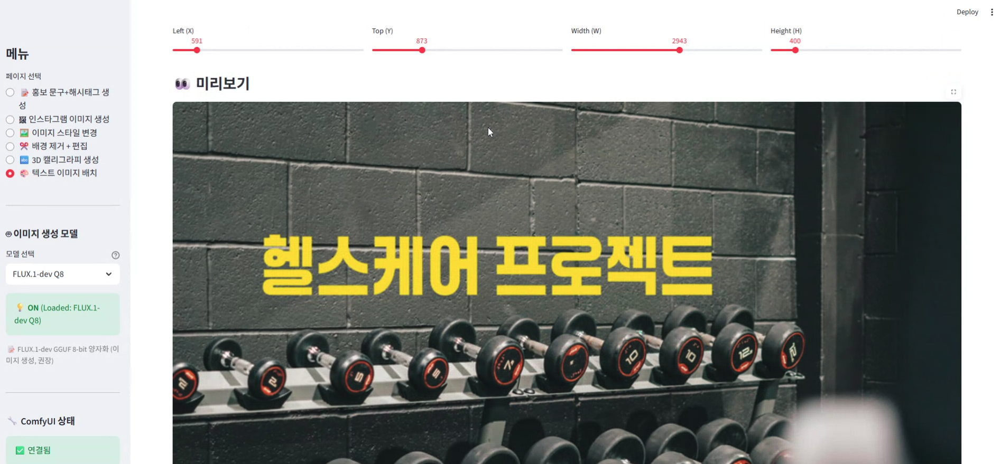

# 🛍️ 소상공인을 위한 광고 제작 서비스 (Fit - AD)
 


> **"딱 맞는, 알맞는 이미지를 제공합니다! Fit - AD."**
>
> 소상공인을 위한 AI 기반 마케팅 자동화 플랫폼 (Flux.1 & ComfyUI 기반)


---

## 1. 🌟 프로젝트 개요
최근 소비 트렌드가 '경험'과 '비주얼' 중심으로 변화함에 따라 요식업, 뷰티, 헬스케어, 소매업 등 모든 업종에서 SNS 마케팅의 중요성이 그 어느 때보다 커졌습니다. 소상공인 창업은 활발히 이루어지고 있지만, 그만큼 동종 업계 간의 경쟁은 더욱 치열해졌습니다.
    
고객 유치를 위해 인스타그램 등 SNS 관리는 필수적인 생존 전략이 되었으나, 본업에 쫓기는 소상공인이 전문적인 콘텐츠를 직접 기획하고 제작하는 것은 엄청난 시간과 노력을 요구합니다. 단순히 스마트폰으로 찍은 투박한 제품 사진이나, "문의 환영"과 같은 익숙한 문구만으로는 더 이상 소비자의 눈길을 사로잡는 경쟁력을 갖기 어렵습니다.
    
본 프로젝트의 목표는 소상공인들이 겪는 이 '마케팅 격차'를 생성형 AI 기술로 메우는 것입니다. 전문 마케터나 디자이너가 아닌, 각 분야의 전문가인 사장님들이 **온라인 광고 콘텐츠 생성 과정에서 겪는 비용적, 심리적 부담과 어려움을 해소**할 수 있음을 기대합니다.


## 2. 프로젝트 소개
이 프로젝트는 최신 생성형 AI 모델(Flux.1, GPT, SDXL)을 활용하여, 비전문가도 **클릭 몇 번으로 '카피라이팅 - 고화질 이미지 - 3D 홍보 텍스트'를 원스톱으로 생성**할 수 있는 자동화 플랫폼입니다.

### 🎯 핵심 목표
- **Accessibility(기술 장벽 해소):** 전문 마케터나 디자이너가 아닌 소상공인도, 기술적 장벽과 심리적 부담 없이 손쉽게 온라인 광고 콘텐츠를 생성할 수 있도록 돕는다.
- **Ready-to-Post(즉시 게시 가능한 품질):** 생성형 AI를 활용해 별도의 추가 가공(Editing) 없이 바로 SNS에 업로드할 수 있는 전문가급의 맞춤형 광고 이미지를 제공한다.
- **Efficiency(본업 집중 지원):** 1인 사업자나 골목 상권의 소규모 매장도 대형 프랜차이즈와 동등하게 온라인 시장에서 경쟁할 수 있는 무기를 갖게 된다.

---

## 📱 3. 실행 화면

<p align="center"></p>
<p align="center"></p>
<p align="center"></p>
<p align="center"></p>
<p align="center"></p>
<p align="center"></p>
<p align="center"></p>
<p align="center"></p>
<p align="center"></p>
<p align="center"></p>
<p align="center"></p>
<p align="center"></p>
<p align="center"></p>
<p align="center"></p>


---
## 🚀 4. 주요 기술 스택 
### Frontend
- Streamlit (1.28+): 직관적인 웹 UI 구성 및 상태 관리
- Pillow: 이미지 전처리 및 시각화

### Backend & API
- FastAPI (0.104+): 비동기 REST API 서버, Pydantic 데이터 검증
- OpenAI API: GPT-5 Mini 기반 마케팅 문구 생성

### AI Core (Generative Models)
- ComfyUI: 노드 기반 이미지 생성 파이프라인 오케스트레이션
- FLUX.1-dev (양자화): 고품질 T2I/I2I 생성 (메모리 최적화 적용)
- FLUX.1-Fill & BEN2: 자연스러운 배경 제거 및 인페인팅
- SDXL ControlNet (Depth): 3D 텍스트 심도 제어

## 📁 5. 프로젝트 구조
```
├── comfyui/                      #ComfyUI 엔진 모듈
├── configs/                      # 전체 시스템 설정 파일 디렉토리
│   ├── frontend_config.yaml.     # Streamlit frontend setup
│   ├── image_editing_config.yaml # AI 이미지 편집 시스템 설정 파일
│   ├── model_config.yaml         # 이미지 생성 모델 설정 파일
│   ├── test/ # 테스트 코드  
│   │   ├── test_flux_gcp.yaml
│   │   └── experiment_t2i_01.yaml
├── Dockerfile                    # 컨테이너 기반 배포를 위한 빌드 설정
├── docs/                         # 프로젝트 개발 문서 및 가이드
│   ├── env_example.md
│   └── 임시.md
├── pyproject.toml                # 프로젝트 메타데이터 및 빌드 시스템 설정(uv) 
├── README.md 
├── requirements.txt              # Python 패키지 의존성 목록
├── scripts/                       #자동화 및 유틸리티 스크립트 모음
│   ├── install_comfyui.sh        # comfyui 설치 자동화 스크립트
│   ├── monitor_backend.sh        # 백엔드 API 집중 모니터링 스크립트 이미지 생성/편집 진행 상황, 프로그레스바, 모델 로딩 등을 실시간으로 표시
│   ├── start_all.sh              # 전체 서버 시작 스크립트 (Uvicorn + ComfyUI + Streamlit)
│   ├── start_comfyui.sh          # ComfyUI 백그라운드 실행 스크립트  
│   ├── stop_all.sh               # 전체 서버 중단 스크립트
│   ├── stop_comfyui.sh           # ComfyUI 중단 스크립트
│   ├── test/ # 테스트 코드  
│   │   ├── prompt_self_test.py 
│   │   ├── validate_model_config.py
│   │   └── test_flux_gcp.py         # FastAPI 없이 model_loader를 직접 사용해서 빠르게 테스트
│   └── torchcheck.py                # PyTorch 버전 및 CUDA 사용 가능 여부 검증
├── src/                         # 소스 코드 메인 디렉토리
│   ├── __init__.py
│   ├── backend/                 # FastAPI 백엔드 서버
│   │   ├── __init__.py 
│   │   ├── comfyui_client.py    # ComfyUI API 클라이언트
│   │   ├── comfyui_workflows.py # T2I, I2I 등 ComfyUI 워크플로우 정의
│   │   ├── exceptions.py        # 백엔드 서비스 커스텀 예외 정의
│   │   ├── main.py              # FastAPI 애플리케이션 진입점 (Entry Point)
│   │   ├── model_loader.py      # 설정 기반 모델 로딩 및 관리
│   │   ├── model_registry.py    # 모델 설정 로드 및 관리
│   │   ├── post_processor.py    # 이미지 생성 후처리 파이프라인
│   │   ├── services.py          # 비즈니스 로직 처리 및 서비스 레이어
│   │   └── text_overlay.py      # 3D 캘리그라피 생성 및 텍스트 합성 모듈
│   └── frontend/
│       ├── __init__.py
│       ├── app.py               # Streamlit Frontend
│       ├── model_selector.py    # 모델 선택 UI 컴포넌트
│       └── utils.py             # Frontend utility
└── uv.lock                      # 의존선 버전 잠금 파일(uv)
```


## 🛠️ 6. 개발 및 배포 환경 (Infrastructure)

본 프로젝트는 Google Cloud Platform (GCP)의 GPU 인스턴스를 코드잇에서 제공받아 구축되었습니다.

### 🖥️ Server Spec (GCP g2-standard-4)

| 분류 | 사양 (Specification) | 비고 |
| :--- | :--- | :--- |
| **GPU** | **NVIDIA L4 (24GB VRAM)** | Ada Lovelace 아키텍처, AI 추론 전용 가속기 |
| **CPU** | Intel Xeon Scalable (4 vCPU) | @ 2.20GHz |
| **RAM** | 16 GB | System Memory |
| **Storage** | 200 GB SSD | 모델 가중치(Weights) 및 캐시 저장용 |
| **OS** | Linux (Ubuntu 22.04 LTS) | 배포 환경 |

### ⚙️ Software & Drivers
- **CUDA Version**: 13.0 (Driver 580.95.05)
- **Python**: 3.12.x
- **Framework**: PyTorch 2.5+ (CUDA 12.x 호환 모드)


> 💡 본 서버 환경은 **시스템 메모리(16GB)가 GPU VRAM(24GB)보다 작은 구조**를 가지고 있습니다. 대형 모델 로딩 시 발생할 수 있는 병목 현상과 OOM(Out Of Memory)을 방지하기 위해 다음과 같은 최적화를 수행했습니다.
> 1. **GGUF 양자화 모델 도입:** 모델 사이즈를 줄여 I/O 부하 감소
> 2. **Sequential Offloading:** 불필요한 모델을 즉시 언로드하는 메모리 관리 로직 구현
> 3. **Swap Memory 활용:** 부족한 시스템 메모리를 보완하기 위해 15GB Swap 공간 확보

## 💡 7. 설치 및 실행

### 사전 요구사항

- **GPU**: NVIDIA GPU 22GB+ VRAM (RTX 4090 권장)
- **OS**: Linux (Ubuntu 20.04+) 또는 Windows with WSL2
- **Python**: 3.12+
- **CUDA**: 12.8+
- **Docker** (선택사항): 컨테이너화 배포용

### 1단계: 환경 설정

```bash
# 저장소 복제
git clone https://github.com/JiyeonGong/Ad_Content_Creation_Service_Team3/
cd Ad_Content_Creation_Service_Team3

# 가상 환경 생성
python3.12 -m venv .venv
source .venv/bin/activate  # Linux/Mac
# 또는
.venv\Scripts\activate  # Windows

# 의존성 설치
pip install -r requirements.txt

# ComfyUI 설치 
# 프로젝트 루트에서 다음 명령어를 입력하여 comfy ui 설치
scripts/install_comfyui.sh 

# ComfyUI 의존성 설치
cd comfyui
pip install -r requirements.txt
cd ..
```

### 2단계: 모델 다운로드

**필수/선택 모델 전체 목록(이 모델들은 /home/shared에서 연결되고 있습니다.)**

- FLUX 계열 (GGUF)
  - `FLUX.1-dev` 텍스트→이미지 및 이미지→이미지
  - `FLUX.1-Fill` 배경 채우기/확장
  - `FLUX.1-Fill-dev-Q8_0.gguf` 또는 동등 GGUF 파일
  - `flux1-dev-Q8_0.gguf`, `flux1-dev-Q4_0.gguf` 중 환경에 맞게 선택

- SDXL & VAE
  - `stable-diffusion-xl-base-1.0` (FP16 권장)
  - `sdxl-vae-fp16-fix` (MadeByOllin)

- ControlNet
  - `controlnet-depth-sdxl-1.0-small`

- 텍스트 인코더/CLIP (GGUF)
  - `t5-v1_1-xxl-encoder-Q8_0.gguf`
  - CLIP Large 호환 파일 (GGUF)

- 기타 리소스
  - 예시 폰트: `/home/shared/ae.safetensors`(VAE), 프로젝트 폰트는 시스템 경로 자동 적용

설치/배치 방법

- 기본적으로 ComfyUI가 최초 실행 시 필요한 모델을 `comfyui/models` 및 캐시로 자동 다운로드/로딩합니다.
- 로컬에 이미 모델이 있는 경우 `comfyui/extra_model_paths.yaml`의 `base_path`를 `/home/shared` 등 실제 저장소로 설정해 인덱싱 속도를 향상하세요.
- 위 목록의 GGUF/FP16 파일은 용량이 크므로 네트워크/디스크 상태에 따라 최초 로딩에 수 분이 소요될 수 있습니다.

필요한 ComfyUI 커스텀 노드 목록

- BEN2 배경 제거: `BEN2_ComfyUI` (직접 클론 및 가중치 다운로드 필요)
  - 소스: https://github.com/PramaLLC/BEN2_ComfyUI
- 4bit/8bit 로더: `ComfyUI_bnb_nf4_fp4_Loaders` (직접 클론 필요)
  - 소스: https://github.com/excosy/ComfyUI_bnb_nf4_fp4_Loaders
- 웹에서 설치(ComfyUI 노드 매니저)
  - `comfyui-impact-pack` (후처리/검출 유틸)
  - `comfyui-impact-subpack` (Impact Pack 서브 유틸)
  - `comfyui_controlnet_aux` (ControlNet 보조/전처리)
  - `ComfyUI-GGUF` (GGUF 로더/유틸)
  - `comfyui-rmbg` (Rembg 인터페이스 노드)
  - `ComfyUI-BRIA_AI-RMBG` (BRIA RMBG 인터페이스)
  - `ComfyUI-Manager` (노드 매니저)
  - 기타 워크플로우 지원 노드들(필요 시 추가)

설치 가이드

```bash
# 직접 클론이 필요한 커스텀 노드
cd comfyui/custom_nodes
git clone https://github.com/excosy/ComfyUI_bnb_nf4_fp4_Loaders.git
git clone https://github.com/PramaLLC/BEN2_ComfyUI.git

# 나머지 노드는 ComfyUI 웹(Manager)에서 설치 권장
# ComfyUI 실행 후 Manager 탭에서 검색/설치
```

### 3단계: 환경 변수 설정

```bash
# .env 파일 생성 (OpenAI API 키만 지정)
cat > .env << EOF
OPENAI_API_KEY=sk-...
EOF
```

### 4단계: 서비스 시작

```bash
# 모든 서비스 자동 시작
bash scripts/start_all.sh

# 개별 시작 (디버깅용)
# 터미널 1: ComfyUI
cd comfyui && python main.py --listen 0.0.0.0 --port 8188

# 터미널 2: FastAPI
cd src/backend && uvicorn main:app --host 0.0.0.0 --port 8000 --reload

# 터미널 3: Streamlit
cd src/frontend && streamlit run app.py --server.port 8501
```

### 5단계: 웹 접속

```
- Streamlit 프론트엔드: http://localhost:8501
- FastAPI 문서: http://localhost:8000/docs
- ComfyUI 대시보드: http://localhost:8188
```

---
## 📑 8. 협업 & 문서 자료
### 👤 개인 협업일지
- **공지연** 👉 [협업일지 링크](https://chlorinated-knife-ad5.notion.site/2a290068d16d8002a362c8131ec36e82?source=copy_link)
- **배진석** 👉 [협업일지 링크](https://chlorinated-knife-ad5.notion.site/2a290068d16d800cbb67d13c601ccb38?source=copy_link)
- **조계승** 👉 [협업일지 링크](https://chlorinated-knife-ad5.notion.site/2a290068d16d80aaae70c691e8978ee2?source=copy_link)
- **조민수** 👉 [협업일지 링크](https://chlorinated-knife-ad5.notion.site/2a290068d16d8078a20fd8c00cece9f4?source=copy_link)

### 프로젝트 문서
- **프로젝트 Notion 페이지** 👉 [Notion 링크](https://chlorinated-knife-ad5.notion.site/part4-3-29490068d16d80778fa3c473cba05d56?source=copy_link)
- **프로젝트 보고서(Notion)** 👉 [Notion 링크](https://chlorinated-knife-ad5.notion.site/Part-4-3-2bd90068d16d803d8bd5f55fa5cf4f32?source=copy_link)
- **최종 발표 자료 및 보고서(pdf)** 👉 [최종 보고서 다운로드]()
